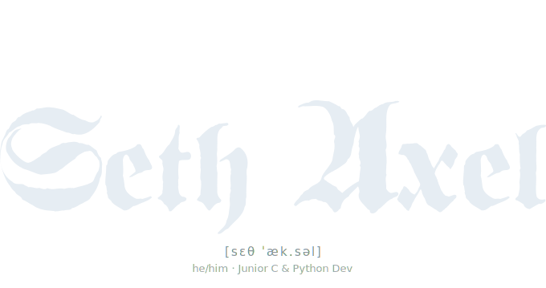
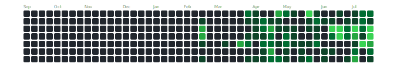
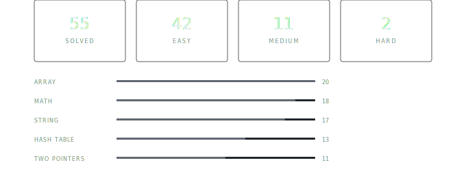

  
  

  
  
  
  
  
  
  

 
 
 

  Student at **École 42** — learning through projects, ego, and pain.
Building things in C from scratch. Occasionally writing Python when I want to feel productive.
Currently obsessed with understanding how things work under the hood. Most of my time is spent working with algorithms, networking, and software architecture.
  I use Neovim btw.

 
 
 

  

  

 
 
 

  

 
 
 

- **I'm working on**: improving my skills in data structures and algorithms, maintaining focus
- **I'm learning**: C, C++, Python, Vim motions
